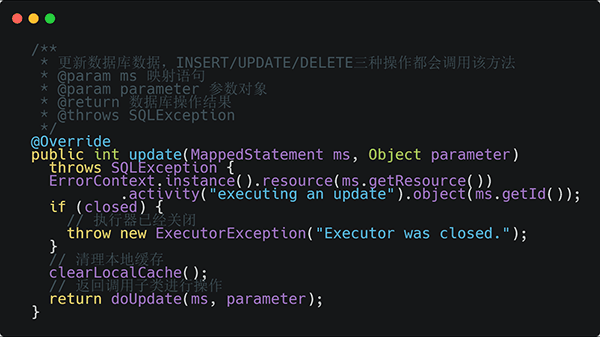

# [MyBatisCN](https://github.com/yeecode/MyBatisCN)

最新Mybatis的源码注解版，源码来自[mybatis-3 稳定版 3.5.2](https://github.com/mybatis/mybatis-3/releases/tag/mybatis-3.5.2)。

该[MybatisCN](https://github.com/yeecode/MyBatisCN)项目对MyBatis中的20包中300多个类进行了注释。注释包括核心方法与核心语句，如下图所示。

---

本项目是《通用源码阅读指导书——MyBatis源码详解》的配套开源项目。

《通用源码阅读指导书——MyBatis源码详解》以MyBatis源码中的包为单位，详细和透彻地介绍每个类的源码，包括其背景知识、组织方式、逻辑结构、实现细节。在本书的讲解中，不漏过每一个类，不跳过每一个难点，做到深浅一致。在阅读MyBatis源码的过程中，本书使用了运行初探、模块归类、合理猜测、类比阅读、网格阅读等许多源码阅读方法，并对这些源码阅读方法进行了进一步的总结整理。

本书适合架构师、程序员提升自己的源码阅读能力、系统架构能力、软件开发能力，也有助于产品经理、测试人员、运维人员等从业者了解软件架构细节。

**书籍购买地址：** [**京东**](https://union-click.jd.com/jdc?e=&p=AyIGZRprFQEaBFQeWBwyVlgNRQQlW1dCFFlQCxxKQgFHREkdSVJKSQVJHFRXFk9FUlpGQUpLCVBaTFhbXQtWVmpSWRtYHQETAlYSax10SA8XeytMZ0xfIFkkVQEMQD1HC0MOHjdUK1sUAxIDXB1TFwIiN1Uca0NsEgZUGloUBxICVitaJQIWD1AZUxQCEg5VE1glBRIOZUAOewQaVAcfDh0FEQVUGVklMiIEZStrFTIRNxd1DEUDFFRcGF4XUEUGUBoJRVFCA1QdXhEAGlRXSFhCABQ3VxpaEQs%3D) | [**淘宝**](https://s.click.taobao.com/fYrflyu) 

**书籍购买地址：** [**京东**](https://union-click.jd.com/jdc?e=&p=AyIGZRprFQEaBFQeWBwyVlgNRQQlW1dCFFlQCxxKQgFHREkdSVJKSQVJHFRXFk9FUlpGQUpLCVBaTFhbXQtWVmpSWRtYHQETAlYSax10SA8XeytMZ0xfIFkkVQEMQD1HC0MOHjdUK1sUAxIDXB1TFwIiN1Uca0NsEgZUGloUBxICVitaJQIWD1AZUxQCEg5VE1glBRIOZUAOewQaVAcfDh0FEQVUGVklMiIEZStrFTIRNxd1DEUDFFRcGF4XUEUGUBoJRVFCA1QdXhEAGlRXSFhCABQ3VxpaEQs%3D) | [**淘宝**](https://s.click.taobao.com/fYrflyu) 

书籍目录：

- 前言
- 【模块 一】背景介绍
- 1 源码阅读
    - 1.1 源码阅读的意义
    - 1.2 源码阅读的方法
    - 1.3 开源软件
    - 1.4 MyBatis源码
    - 1.5 本书结构
        - 1.5.1 背景知识
        - 1.5.2 文件的指代
        - 1.5.3 方法的指代
- 2 MyBatis概述
    - 2.1 背景介绍
        - 2.1.1 传统数据库连接
        - 2.1.2 ORM框架
        - 2.1.3 MyBatis特点
    - 2.2 快速上手
        - 2.2.1 MyBatis包的引入
        - 2.2.2 MyBatis的简单配置
        - 2.2.3 基于MyBatis的数据库操作
    - 2.3 MyBatis的核心功能分析
- 3 MyBatis运行初探
    - 3.1 初始化阶段追踪
        - 3.1.1 静态代码块的执行
        - 3.1.2 获取InputStream
        - 3.1.3 配置信息读取
        - 3.1.4 总结
    - 3.2 数据读写阶段追踪
        - 3.2.1 获得SqlSession
        - 3.2.2 映射接口文件与映射文件的绑定
        - 3.2.3 映射接口的代理
        - 3.2.4 SQL语句的查找
        - 3.2.5 查询结果缓存
        - 3.2.6 数据库查询
        - 3.2.7 处理结果集
        - 3.2.8 总结
- 4 MyBatis源码结构概述
    - 4.1 包结构
    - 4.2 分组结构
- 【模块 二】基础功能包源码阅读
- 5 exceptions包
    - 5.1 背景知识
        - 5.1.1 Java的异常
        - 5.1.2 序列化与反序列化
    - 5.2 Exception类
    - 5.3 ExceptionFactory类
- 6 reflection包
    - 6.1 背景知识
        - 6.1.1 装饰器模式
        - 6.1.2 反射
        - 6.1.3 Type接口及其子类
    - 6.2 对象工厂子包
    - 6.3 执行器子包
    - 6.4 属性子包
    - 6.5 对象包装器子包
    - 6.6 反射核心类
    - 6.7 反射包装类
    - 6.8 异常拆包工具
    - 6.9 参数名解析器
    - 6.10 泛型解析器
- 7 annotations包与lang包
    - 7.1 背景知识
        - 7.1.1 Java注解详解
    - 7.2 Param注解分析
- 8 type包
    - 8.1 背景知识
        - 8.1.1 模板模式
    - 8.2 类型处理器
        - 8.2.1 类型处理器基类与实现类
        - 8.2.2 TypeReference类
    - 8.3 类型注册表
- 9 io包
    - 9.1 背景知识
        - 9.1.1 单例模式
        - 9.1.2 代理模式
        - 9.1.3 静态代理
        - 9.1.4 VFS
    - 9.2 VFS实现
        - 9.2.1 DefaultVFS
        - 9.2.2 JBoss6VFS
    - 9.3 类文件的加载
    - 9.4 ResolverUtil类
- 10 logging包
    - 10.1 背景知识
        - 10.1.1 适配器模式
        - 10.1.2 日志框架与日志级别
        - 10.1.3 基于反射的动态代理
    - 10.2 Log接口
    - 10.3 Log接口的实现类
    - 10.4 LogFactory
    - 10.5 JDBC日志打印
- 11 parsing包
    - 11.1 背景知识
        - 11.1.1 XML文件
        - 11.1.2 XPath
    - 11.2 XML解析
    - 11.3 文档解析中的变量替换
- 【模块 三】配置解析包源码阅读
- 12 配置解析概述
- 13 binding包
    - 13.1 数据库操作的接入
        - 13.1.1 数据库操作的方法化
        - 13.1.2 数据库操作方法的接入
    - 13.2 抽象方法与数据库操作节点的关联
    - 13.3 数据库操作接入总结
        - 13.3.1 初始化阶段
        - 13.3.2 数据读写阶段
    - 13.4 MyBatis与Spring、Spring Boot的整合
- 14 builder包
    - 14.1 背景知识
    - 14.1.1 建造者模式
    - 14.2 建造者基类与工具类
    - 14.3 SqlSourceBuilder与StaticSqlSource
    - 14.4 CacheRefResolver和ResultMapResolver
        - 14.4.1 CacheRefResolver类
        - 14.4.2 ResultMapResolver类
    - 14.5 ParameterExpression类
    - 14.6 XML文件解析
        - 14.6.1 XML文件的声明解析
        - 14.6.2 配置文件解析
        - 14.6.3 数据库操作语句解析
        - 14.6.4 Statement解析
        - 14.6.5 引用解析
    - 14.7 注解映射的解析
        - 14.7.1 注解映射的使用
        - 14.7.2 注解映射解析的触发
        - 14.7.3 直接注解映射的解析
        - 14.7.4 间接注解映射的解析
- 15 mapping包
    - 15.1 SQL语句处理功能
        - 15.1.1 MappedStatement类
        - 15.1.2 SqlSource类
        - 15.1.3 BoundSql
    - 15.2 输出结果处理功能
        - 15.2.1 ResultMap
        - 15.2.2 ResultMapping
        - 15.2.3 Discriminator
    - 15.3 输入参数处理功能
    - 15.4 多数据库种类处理功能
    - 15.5 其他功能类
- 16 scripting包
    - 16.1 背景知识
        - 16.1.1 OGNL
    - 16.2 语言驱动接口及语言驱动注册表
    - 16.3 SQL节点树的组建
    - 16.4 SQL节点树的解析
        - 16.4.1 OGNL辅助类
        - 16.4.2 表达式求值器
        - 16.4.3 动态上下文
        - 16.4.4 SQL节点及其解析
    - 16.5 再论SqlSource
        - 16.5.1 SqlSource的生成
        - 16.5.2 DynamicSqlSource的转化
        - 16.5.3 RawSqlSource的转化
        - 16.5.4 SqlSource接口的实现类总结
- 17 datasource包
    - 17.1 背景知识
        - 17.1.1 java.sql包和javax.sql包
        - 17.1.2 DriverManager
        - 17.1.3 DataSource
        - 17.1.4 Connection
        - 17.1.5 Statement
    - 17.2 数据源工厂接口
    - 17.3 JNDI数据源工厂
    - 17.4 非池化数据源及工厂
        - 17.4.1 非池化数据源工厂
        - 17.4.2 非池化数据源
    - 17.5 池化数据源
        - 17.5.1 池化数据源类的属性
        - 17.5.2 池化连接的给出与收回
        - 17.5.3 池化连接
    - 17.6 论数据源工厂
- 【模块 四】核心操作包源码阅读
- 18 jdbc包
    - 18.1 AbstractSQL类与SQL类
        - 18.1.1 SafeAppendable内部类
        - 18.1.2 SQLStatement内部类
        - 18.1.3 AbstractSQL类
        - 18.1.4 SQL类
    - 18.2 SqlRunner
    - 18.3 ScriptRunner
    - 18.4 jdbc包的独立性
- 19 cache包
    - 19.1 背景知识
        - 19.1.1 Java对象的引用级别
        - 19.1.2 ReferenceQueue
    - 19.2 cache包结构与Cache接口
    - 19.3 缓存键
        - 19.3.1 缓存键的原理
        - 19.3.2 缓存键的生成
    - 19.4 缓存的实现类
    - 19.5 缓存装饰器
        - 19.5.1 同步装饰器
        - 19.5.2 日志装饰器
        - 19.5.3 清理装饰器
        - 19.5.4 阻塞装饰器
        - 19.5.5 定时清理装饰器
        - 19.5.6 序列化装饰器
    - 19.6 缓存的组建
    - 19.7 事务缓存
    - 19.8 MyBatis缓存机制
        - 19.8.1 一级缓存
        - 19.8.2 二级缓存
        - 19.8.3 两级缓存机制
- 20 transaction包
    - 20.1 背景知识
        - 20.1.1 事务概述
    - 20.2 事务接口及工厂
    - 20.3 JDBC事务
    - 20.4 容器事务
- 21 cursor包
    - 21.1 背景知识
        - 21.1.1 Iterable接口与Iterator接口
    - 21.2 MyBatis中游标的使用
    - 21.3 游标接口
    - 21.4 默认游标
        - 21.4.1 CursorStatus内部类
        - 21.4.2 ObjectWrapperResultHandler内部类
        - 21.4.3 CursorIterator内部类
        - 21.4.4 DefaultCursor外部类
- 22 executor包
    - 22.1 背景知识
        - 22.1.1 基于cglib的动态代理
        - 22.1.2 javassist框架的使用
        - 22.1.3 序列化与反序列化中的方法
        - 22.1.4 ThreadLocal
        - 22.1.5 存储过程
        - 22.1.6 Statement及其子接口
    - 22.2 主键自增功能
        - 22.2.1 主键自增的配置与生效
        - 22.2.2 Jdbc3KeyGenerator
        - 22.2.3 SelectKeyGenerator
    - 22.3 懒加载功能
        - 22.3.1 懒加载功能的使用
        - 22.3.2 懒加载功能的实现
        - 22.3.3 懒加载功能对序列化和反序列化的支持
    - 22.4 语句处理功能
        - 22.4.1 MyBatis对多语句类型的支持
        - 22.4.2 MyBatis的语句处理功能
    - 22.5 参数处理功能
    - 22.6 结果处理功能
    - 22.7 结果集处理功能
        - 22.7.1 MyBatis中多结果集的处理
        - 22.7.2 结果集封装类
        - 22.7.3 结果集处理器
    - 22.8 执行器
        - 22.8.1 执行器接口
        - 22.8.2 执行器基类与实现类
    - 22.9 错误上下文
- 23 session包
    - 23.1 SqlSession及其相关类
        - 23.1.1 SqlSession的生成链
        - 23.1.2 DefaultSqlSession类
        - 23.1.3 SqlSessionManager类
    - 23.2 Configuration类
    - 23.3 其他类
- 24 plugin包
    - 24.1 背景知识
        - 24.1.1 责任链模式
    - 24.2 MyBatis插件开发
    - 24.3 MyBatis拦截器平台
    - 24.4 MyBatis拦截器链与拦截点
- 【模块 五】总结与展望
- 25 源码阅读总结
    - 25.1 前期准备
        - 25.1.1 工具准备
        - 25.1.2 项目选择
        - 25.1.3 项目使用
    - 25.2 项目初探
    - 25.3 源码阅读
        - 25.3.1 模块分析
        - 25.3.2 模块归类
        - 25.3.3 自底向上
        - 25.3.4 合理猜测
        - 25.3.5 类比阅读
        - 25.3.6 善于汇总
        - 25.3.7 网格阅读
- 26 优秀开源项目推荐
    - 26.1 Guava
    - 26.2 Tomcat
    - 26.3 Redis
    - 26.4 Dubbo
    - 26.5 React

**书籍购买地址：** [**京东**](https://union-click.jd.com/jdc?e=&p=AyIGZRprFQEaBFQeWBwyVlgNRQQlW1dCFFlQCxxKQgFHREkdSVJKSQVJHFRXFk9FUlpGQUpLCVBaTFhbXQtWVmpSWRtYHQETAlYSax10SA8XeytMZ0xfIFkkVQEMQD1HC0MOHjdUK1sUAxIDXB1TFwIiN1Uca0NsEgZUGloUBxICVitaJQIWD1AZUxQCEg5VE1glBRIOZUAOewQaVAcfDh0FEQVUGVklMiIEZStrFTIRNxd1DEUDFFRcGF4XUEUGUBoJRVFCA1QdXhEAGlRXSFhCABQ3VxpaEQs%3D) | [**淘宝**](https://s.click.taobao.com/fYrflyu) 